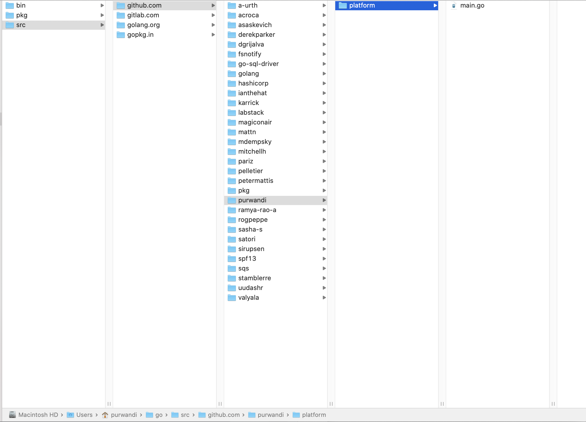

# Agenda

1. Tipe Data,
2. Variabel
3. Kendali Alur
4. Package Dependency

---

# Tipe Data?

- Apa itu?
- Mengapa kita perlu menggunakannya?

---

# Tipe Data

- Dalam pemrograman, tipe data memegang peranan penting, karena inilah yang menjamin validitas data yang digunakan
- Tipe data yang diinginkan oleh sebuah program, harus tepat saat program tersebut digunakan
- Bahasa pemrograman yang dicompile seperti Go, akan mengecek validitas data ini pada saat compile
- Karena sifatnya sebagai bahasa dengan static typing, dalam Go, semua data harus mempunyai tipe dan tipenya tidak boleh berubah

---

# Case Penggunaan

> Saat kita menyimpan data gaji, maka kita akan menyimpannya dengan tipe data angka (numeric), bukan teks


---

# Tipe Data Dalam Go

- Numeric ( desimal & non desimal)
- String
- Boolean

---

# Numeric Non Desimal

- `uint` untuk tipe data bilangan cacah positif
- `int` untuk tipe data bilangan cacah negative dan positif

---

# Numeric Non Decimal Positif `uint`

- `uint8` value mulai dari `0` ↔ `255`
- `uint16` value mulai dari `0` ↔ `65.535`
- `uint32` value mulai dari `0` ↔ `4.294.967.295`
- `uint64` value mulai dari `0` ↔ `18.446.744.073.709.551.615`
- `uint` sama dengan `uint32` dan `uint64` tapi tergantung valuenya (otomatis menyesuaikan)
- `byte` sama dengan `uint8`


---

# Contoh

```go
package main

import "fmt"

func main() {
   var angkaKecil uint8 = 254
   var angkaBesar = 2333224443333

   fmt.Printf("Bilangan positive : %d\n", angkaKecil)
   fmt.Printf("Bilangan positive besar : %d\n", angkaBesar)
}
```

---

# Ayo Tebak Aku

- 69.234
- 10.000.123.212.123
- 3.232.234.221
- 5.383.123.900
- 255
- 256

---

# Numeric Non Decimal Negatif & Positif

- `int8` value mulai dari `-128` ↔ `127`
- `int16` value mulai dari `-32.768` ↔ `32.767`
- `int32` value mulai dari `-2.147.483.648` ↔ `2.147.483.647`
- `int64` value mulai dari `-9.223.372.036.854.775.808` ↔ `9.223.372.036.854.775.807`
- `int` sama dengan int32 atau int64 tapi tergantung nilai (otomatis menyesuaikan)
- `rune` sama dengan int32

---

# Contoh

```go
package main

import "fmt"

func main() {
  var angkaKecil int8 = 100
  var angkaBesar = 300

  angkaBesar = -200
  angkaKecil = -10

  fmt.Printf("Negative kecil : %d\n", angkaKecil)
  fmt.Printf("Negative besar : %d\n", angkaBesar)
}
```

---

# Tebak Aku

- `-10.100`
- `-10.000.123.212`
- `3.232.234.221`


---

# Numeric Decimal

- `float32` adalah jenis tipe data yang berukuran 32bit.
- `float64` adalah jenis tipe data yang berukuran 64bit

```
fmt.Println(98.8)
fmt.Println(10.5 - 2.1)
fmt.Println(5.6 / 2)
```

---

# Numeric

Semua operasi matematika bisa dilakukan untuk data-data ini (`+`, `-`. `:`, `*`, `%`)

---

> # ?
> Apa yang terjadi jika operasi terhadap float dan integer digabung?

---

# String

- String adalah tipe data untuk menyimpan data karakter yang akan menyimpan sebuah representasi teks
- String dalam Go tersusun atas beberapa byte individual, umumnya 1 untuk setiap karakter
- String ditandai dengan tanda kutip `""` atau ``
- Contoh:


---

# Contoh

```
package main

import "fmt"

func main() {
    var name string = "Hallo"

    fmt.Printf("%s", name)
}

```

---


```
fmt.Println(len("Hello, World"))
fmt.Println("Hello, World"[1])
fmt.Println("Hello, " + "World")
```

---

# Boolean

- Boolean adalah tipe data 1 bit, yang mendeksripisikan tingkat kebenaran sebuah data
- Hanya memiliki 2 nilai: `true` atau `false`
- Operasi yang bisa dilakukan untuk data dengan tipe ini adalah operasi boolean (AND `&&`, OR `||`, NOT `!`)

---

# Contoh

```go
package main

import "fmt"

func main() {
	var CanReadStory bool = true

	fmt.Printf("%t\n", CanReadStory)
}
```

---

# Contoh:

```
fmt.Println(true && true)
fmt.Println(true && false)
fmt.Println(true || true)
fmt.Println(true || false)
fmt.Println(!true)
```

---

# Default value tipe data

- Nilai default `string` adalah `""` (string kosong)
- Nilai default `bool` adalah `false`
- Nilai default tipe numerik non-desimal adalah `0`
- Nilai default tipe numeric desimal adalah `0.000000`


---

# Contoh

```
package main

import "fmt"

func main() {
   var Name string
   var CanReadStory bool
   var CommentCount uint8
   var Sallary float32


   fmt.Printf("%s\n", Name)
   fmt.Printf("%t\n", CanReadStory)
   fmt.Printf("%d\n", CommentCount)
   fmt.Printf("%f\n", Sallary)
}
```

---

# Variabel

- Secara tidak langsung di atas kita menggunakan variabel
- Menurut kamu variabel itu apa sih? Kenapa harus ada variabel?
- Menurut kamu membuat nama variabel yang baik itu seperti apa?
- Apakah ada tips yang bisa kamu bagikan ke temenmu menengai pembuatan variabel?

---

# Variabel

- Variabel adalah sebuah tempat penyimpanan data, dengan nama dan tipe tertentu
- Isi sebuah variabel bisa berubah, tapi kita bisa terus memanggilnya dengan nama yang sama
- Contoh:

```
var x string = "Hello, World"
fmt.Println(x)
```

---

# Variabel

- Deklarasi dan assignment data pada sebuah variabel, juga bisa dilakukan dalam langkah yang berbeda
- Contoh:

```
var x string
x = "Hello, World"
fmt.Println(x)

```

---

# Variabel

- Sebuah variabel bisa diassign nilai baru
- Bahkan kita juga bisa melakukan assignment dan operasi matematika dalam 1 pernyataan


```
var x string
x = "Didit"
fmt.Println(x)
x = "Joni"
fmt.Println(x)
x += " ke pasar"
fmt.Println(x)
```

---

# Variabel

- Untuk membuat dan mengassign sebuah variabel dalam 1 langkah, maka Go menyediakan sebuah langkah pendek
- Ini adalah metode yang disarankan, bilamana dimungkinkan

```
func main() {
  usia := 17
  fmt.Println(usia)
}
```

> **Notes**
> Hanya bisa digunakan apabila declarasinya di dalam sebuah fungsi

---

# Penamaan Variabel

- Sebuah variabel bisa dinamai apapun
- Nama bisa mengandung huruf, angka atau underscore (`_`)
- Pilihlah nama yang se-deskriptif mungkin

```
namaKucing := "Si Belang"
lokasi2 := "Jalan Amil"
umur_anak := 9
```

---

# Scope Variabel

- Fungsi yang dibuat di dalam sebuah blok, hanya bisa diakses oleh blok tersebut

```
func list() {
  var x string = "Kumparan"
  fmt.Println(x)
}

func main() {
  fmt.Println(x)
}

```

---

# Scope Variabel

-  fungsi yang didefinisikan di luar blok, bisa diakses blok-blok lain

```
var perangkat string = "laptop"

func main() {
  fmt.Println(perangkat)
}

```

---

# Mendefinisikan Beberapa Variabel

Go juga memiliki fitur yang memudahkan menuliskan beberapa variabel sekaligus

```
var a, b uint8 = 20, 10, 200

var (
  a uint8 = 20
  b uint8 = 10
)

var (
  a = 20
  b = 10
)

a, b := 20, 10
```

---

# Variable Underscore `_`

- Hanya ditemui digolang, karena setiap variable yang kamu declrasi wajib kamu gunakan
- Klo kamu tidak gunakan maka compilernya akan ngomel
- Underscore `_` adalah sebuah predefined variable yang bisa kita gunakan untuk menampung variable yang nantinya tidak akan kita pakai

---

# Contoh

```
func main() {
   FirstName, LastName := "Foo", "Bar"

   fmt.Printf("%s\n", LastName)
}

```

Apabila kita hanya menggunakan `LastName` saja pada fungsi kita maka akan terjadi error

---


# Contoh

```
func main() {
   _, LastName := "Foo", "Bar"

   fmt.Printf("%s\n", LastName)
}

```

- Dengan menggunakan `_` kita bisa menampung nilai dari sebuah nilai ke dalam sebuah prdefined variabel tersebut, dan dapat dipastikan program kita tetap berjalan sebagaimana mestinya.
- Akan sering kalian jumpai di bagian fungsi yang melakukan multiple return
- Akan sering dipakai pas waktu membuat unit test


---

# Constant

- Constant adalah sebuah variabel yang nilainya tidak bisa diubah lagi
- Dibuat dengan cara yang sama seperti membuat variabel, tapi kali ini menggunakan keyword `const`
- Biasa digunakan untuk menggunakan nilai yang sama, berkali-kali di dalam program tanpa ada kebutuhan untuk mengubah nilainya

```
const film string = "Spiderman"
fmt.Println(film)
```
---

# Operator

- Operator Aritmatika (`+`, `-`, `*`, `/`, `%`)
- Operator Perbandingan (`==`, `!=`, `<`, `<=`, `>`, `>=`)
- Operator Logika (`&&`, `||`, `!`)

---

# Latihan

1. Buatlah program yang mengkonversi us dolar ke rupiah
2. Buatlah program yang menghitung luas sebuah lingkaran berdasarkan jari-jarinya

---

# Struktur Kendali

- Tentu saja sebuah program tidak mungkin berjalan linear dari atas ke bawah, pasti akan ada percabangan atau pengulangan dalam menjalankan instruksi
- Ini diaplikasikan dengan sistem kendali alur
- Ada 3 yang akan kita bahas: `for`, `if` dan `switch`

---

# for

- `for` digunakan untuk melakukan sebuah pernyataan berulang-ulang tanpa perlu ditulis manual
- contoh melakukan pengulangan 10 kali

```
package main

import "fmt"

func main() {
    i := 1
    for i <= 10 {
        fmt.Println(i)
        i = i + 1
    }
}
```
---

```
package main

import "fmt"

func main() {

    for i := 1; i <= 10; i++ {
        fmt.Println(i)
    }
}
```
---

# Keyword break dan continue


```
package main

import "fmt"

func main() {

  for i := 1; i <= 10; i++ {
      if i % 2 == 1 {
          continue
      }

      if i > 8 {
          break
      }

      fmt.Println("Angka", i)
  }
}
```

---

- `break` merupakan keyword yang digunakan untuk melakukan penghentian perulangan
- `continue` merupakan keyword yang digunakan untuk memaksa perulangan ke selanjutnya

---

# if

- `if` digunakan untuk mengimplementasikan percabangan
- Cabang mana yang akan dijalankan, ditentukan oleh kondisi yang kita spesifikkan

```
if i % 2 == 0 {
    // habis dibagi 2
} else if i % 3 == 0 {
    // habis dibagi 3
} else if i % 4 == 0 {
    // dhabis dibagi 4
}
```

---

> # i
> di Golang tidak mendukung **ternary**

---

# switch

- `switch` mirip dengan `if-else if-else if-...-else`
- Penulisan dengan `switch` bisa jadi lebih mudah dibaca

```
switch i {
case 0: fmt.Println("Zero")
case 1: fmt.Println("One")
case 2: fmt.Println("Two")
case 3: fmt.Println("Three")
case 4: fmt.Println("Four")
case 5: fmt.Println("Five")
default: fmt.Println("Unknown Number")
}
```

---

# Latihan

1. Buatlah sebuah program FizzBuzz yang akan menuliskan angka dari 1-100 dengan aturan sebagai berikut:
  - Angka yang habis dibagi 3 ditulis "Fizz"
  - Angka yang habis dibagi 5 ditulis "Buzz"
  - Angka yang habis dibagi 15 ditulis "FizzBuzz"
  - Di luar itu, angka ditulis apa adanya
2. Buatlah sebuah program yang akan menghitung jumlah hari di antara 2 tanggal, misal dari 3 Januari sampai 10 Februari ada 39 hari


---

# Package Dependencies


- Apa itu package dependencies?
- Mengapa kita perlu?

---

# Package Dependencies

- Golang tidak memiliki package repository khusus seperti pada ekosistem bahasa lain seperti npm registry, crates registry, packagist
- Menggunakan git service sebagai penyedia package dengan cara mengambil langsung source dari repositorynya
- Umumnya package yang kita gunakan akan ada di git (github, gitlab, dsb)
- Versi package yang kita gunakan biasanya sesuai dengan versi  git tag, contohnya https://github.com/labstack/echo/tags

---

# Package Manager

- go dep
- go mod <- rekomendasi menggunakan go mod, karena kemudahannya dalam penerapan semantic versioning di dependencynya

---

Dahulu sebelum ada era go 1.11 ketika kita mengerjakan project go maka kita harus berada pada gopath folder

---



---

Namun itu semua berubah ketika `go mod` datang. Adanya `go mod`
memungkinkan untuk melakukan pengerjaan project diluar `GOPATH`

Apabila kita menggunakan `go mod` tetapi project kita letakkan ke dalam folder `GOPATH` justru akan terjadi error

---

# Memulai go mod

- Pastikan versi `go` kalian menggunakan versi 1.11.+
- Buatlah folder project kalian di sembarang tempat, jangan di `GOPATH`

```
$ mkdir ~/Code/awesome-project
$ cd ~/Code/awesome-project
$ go mod init github.com/<username>/awesome-project
```

---

# `go.mod` dan `go.sum`

- Akan ada dua file di dalam project kalian yakni `go.mod` dan `go.sum`
- `go.mod` berisi package dependency untuk memastikan project kalian bisa jalan versi package mana yang kalian pakai. (`package.json` dan `composer.json`)
- `go.sum` berisi informasi hash package dan memastikan ada proses tempering dan modifikasi pada waktu kita melakukan download (`package-lock.json` dan `composer.lock`)

---

# Menginstall dependency

Kali ini kita integrasikan echo framework dengan project kita

```
$ cd ~/Code/awesome-project
$ go get github.com/labstack/echo
```

maka dengan command ini:

- download package dan diletakkan di `go/pkg/mod`
- update file `go.mod` yang menambahkan informasi package requirement
- update hash informasi di `go.sum`

---

# Latihan

1.Implementasikan sample README.md github.com/labstack/echo di main.go kalian
2.Coba jalankan :-)

---

# `go.mod` dan `go.sum` sudah ada

Kamu bisa gunakan

```
$ cd ~/Code/awesome-project
$ go get
```

Untuk menginstall dependenciesnya

---

# Memilih versi yang spesifik

```
$ cd ~/Code/awesome-project
$ go get github.com/labstack/echo@v3.3.9
```

# Update versi package

```
$ cd ~/Code/awesome-project
$ go get -u
$ go get -u github.com/labstack/echo
```
---

# Eject ke folder vendor

```
$ cd ~/Code/awesome-project
$ go mod vendor
```
