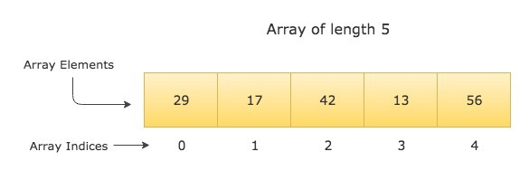

# Array, Slice dan Map

---

# Array

- Menurutmu array itu apa sih?
- Fungsi kegunaan array itu menurut kamu apa?

---

# Array

- Merupakan sekumpulan data dengan tipe yang sama yang disimpan dalam sebuah variabel
- Fungsi, karena sifatnya adalah berkelompok, maka sangat cocok untuk menyimpan sekumpulan informasi untuk kemudian dapat dilakukan metodologi pencarian/menyusuri data yang terdapat dalam array tersebut

---

# Karakteristik Array

- Memiliki kapasitas nilai pada saat inisiasi pertama kalinya
- Nilai default untuk tiap element array, sesuai dengan tipe datanya:
  - Jika string maka `""`
  - Jika bool maka `false`
  - Jika int maka `0`
  - Jika float maka `0.00`
- Memiliki indeks sebagai alamat untuk merepresentasikan urutan
- Index array dimulai dari 0

---

# Array



---

# Deklarasi Array Dalam Golang

```
var a[n]T
```

Dimana:
- `a` merupakan nama sebuah variabel yang nantinya akan menyimpan array
- `n` adalah jumlah panjang ukuran dari sebuah array
- `T` adalah tipe data yang merepresentasikan value masing-masing informasi yang terdapat dalam array tersebut

---

# Contoh

```go
package main
import "fmt"

func main() {
  var x [5]int // An array of 5 integers
  fmt.Println(x)

  var y [8]string // An array of 8 strings
  fmt.Println(y)
}
```

---

# Contoh

```go
package main

import "fmt"

func main() {
  var names [4]string
  name[0] = "Luthfi"
  name[1] = "Samuel"
  name[2] = "Fajar"
  name[3] = "Fajri"
  fmt.Println(name[0], name)
}
```

---

# Mengakses Array

- Array diakses dengan menggunakan indeksnya, sebagaimana di contoh sebelumnya
- Lazim juga diakses dengan menggunakan for loop

```go
a := [4]{1, 2, 3, 4}
for i, v := range a {
  fmt.Printf("%d %d\n", i, v)
}
```

> Mari kita mengingat kembali pembelajaran kemarin!
> bagaimana jika kita tidak ingin menggunakan `i` di loop di atas?

---

Contoh melakukan akses array dengan melakukan foor loop berdasarkan length

```go
package main
import "fmt"

func main() {
  names := [3]string{"Mark Zuckerberg", "Bill Gates", "Larry Page"}

  for i := 0; i < len(names); i++ {
    fmt.Println(names[i])
  }
}
```

---

Disamping itu kita juga mengakses array dengan melakukan manipulasi index awal dan akhirnya

```go
r := [...]int{1, 2, 3, 4}
fmt.Println(r)            // [1 2 3 4]
fmt.Println(r[0:2])       // [1 2]
fmt.Println(r[1:2])       // [2]
fmt.Println(r[0:3])       // [1 2 3]
fmt.Println(r[2:])        // [3 4]
fmt.Println(r[:2])        // [1 2]
fmt.Println(r[2:len(r)])  // [3 4]
```

> Detailnya akan kita bahas dalam bahasan `slice`

---

- Sebuah array juga bisa diinisialisasi tanpa menulis ukurannya secara eksplisit. Contohnya sebagai berikut

  ```go
  // menghasilkan array berukuran 3
  q := [...]int{1, 2, 3}
  ```
- Ukuran sebuah array, bisa dicek dengan menggunakan fungsi len, bawaan array tersebut
  ```go
  // menghitung ukuran array q
  len(q)
  ```

---

- Dalam sebuah array, ukuran juga menjadi bagian dari tipe datanya
- Dengan demikian, [3]int dan [4]int adalah 2 tipe data yang berbeda
- Ukuran array juga harus bisa ditentukan ketika program dikompilasi
- 2 buah array dikatakan sama jika jumlah data dan isi keduanya, sama.

---

# Kuis untuk dijawab langsung

Mana yang sama di antara ketiga array ini? Coba bandingkan dengan operan ==
- a := [2]int{1, 2}
- b := [...]int{1,2}
- c := [2]int{1,3}

---

# Kuis untuk dijawab langsung

Apakah arti dari

```go
r := [...]int{40:3}
```

---

# Latihan 1

1. Buatlah 2 buah array berukuran 20 dan isilah dengan 20 angka acak
2. Buatlah program yang akan menampilkan semua anggota yang berbeda dari kedua array tersebut

Contoh:

- a := [20]int{1, 2, 3}
- b := [20]int{4,5,6}

yang ditampilkan di layar:: 4, 5, 6

---

# Latihan 2

1. Buatlah 1 buah array berukuran 30 dan isilah dengan 20 angka acak
2. Buatlah program yang akan menampilkan semua anggota yang dengan ketentuan:

   - Tampilkan seluruh bilangan genap dan hitung countnya
   - Tampilkan seluruh bilangan ganjil dan hitung countnya
   - Tampilkan seluruh bilangan prima dan hitung countnya

---

# Slice

- Merupakan representasi dari sebuah array yang mereferensikan valuenya dari sebuah array
- Karakteristik dari sebuah slice, dia mekaukan referensi terhadap sumber array yang dijadikan source olehnya

> **notes**

- Sama-sama memiliki indeks baik slice maupun array
- Bedanya dengan array, slice dapat berubah ukuran kapasitasnya

---

```go
package main

import "fmt"

func main() {
  a := [7]string{"Mon", "Tue", "Wed", "Thu", "Fri", "Sat", "Sun"}

  slice1 := a[1:]
  slice2 := a[3:]

  fmt.Println("------- Before Modifications -------")
  fmt.Println("a  = ", a)
  fmt.Println("slice1 = ", slice1)
  fmt.Println("slice2 = ", slice2)

  slice1[0] = "TUE"
  slice1[1] = "WED"
  slice1[2] = "THU"

  slice2[1] = "FRIDAY"

  fmt.Println("\n-------- After Modifications --------")
  fmt.Println("a  = ", a)
  fmt.Println("slice1 = ", slice1)
  fmt.Println("slice2 = ", slice2)
}
```

---

# Diagram Slice


---

# Karakteristik Slice

Punya 3:
- Sebuah pointer (reference) yang mereferensikan dalam susunan array
- Panjang, merupakan panjang size array dari slice yang dibuat
- Capacity, yakni ukuran maksimum yang dapat di akomodir dalam sebuah size, dalam hal ini sesuai dengan capasitas maksimum dari array yang di referensi

---

# Contoh

Dibawah ini kita dapat meliha sample slice:

```go
package main

import "fmt"

func main() {
  a := [6]int{10, 20, 30, 40, 50, 60}
  s := a[1:4]

  fmt.Printf("s = %v, len = %d, cap = %d\n", s, len(s), cap(s))
}
```

---

- Panjang dari sebuah slice dapat di extend sesuai dengan jumlah kapasitasi reference array tersebut, tentunya dengan cara dilakukan re-slicing.
- Apabila ada keinginan untuk melakukan extend diluar dari kapasitasnya maka akan terjadi error

---

```go
package main

import "fmt"

func main() {
  s := []int{10, 20, 30, 40, 50, 60, 70, 80, 90, 100}
  fmt.Println("Original Slice")
  fmt.Printf("s = %v, len = %d, cap = %d\n", s, len(s), cap(s))

  s = s[1:5]
  fmt.Println("\nAfter slicing from index 1 to 5")
  fmt.Printf("s = %v, len = %d, cap = %d\n", s, len(s), cap(s))

  s = s[:8]
  fmt.Println("\nAfter extending the length")
  fmt.Printf("s = %v, len = %d, cap = %d\n", s, len(s), cap(s))

  s = s[2:]
  fmt.Println("\nAfter dropping the first two elements")
  fmt.Printf("s = %v, len = %d, cap = %d\n", s, len(s), cap(s))
}
```

---

# Fungsi - fungsi yang digunakan untuk manipulasi slice:

- make
- append
- copy

---

# `make` function

Make function adalah fungsi bawaand dari golang untuk mebuat sebua slice

```go
func make([]T, len, cap) []T
```

---

# Contoh

```go
package main

import "fmt"

func main() {
  // Creates an array of size 10, slices it till index 5, and returns the slice reference
  s := make([]int, 5, 10)
  fmt.Printf("s = %v, len = %d, cap = %d\n", s, len(s), cap(s))
}
```

---

# `copy` function

- Fungsi copy digunakan untuk menduplikasi slice element
- Karena karakteristik slice yang melakukan referense terhadap array yang di referensi, maka untuk melukan duplikasi / copy sehingga apabila terdapat perubahan source array masih tetap sama

```copy(dst, src)```

---

# Contoh

```go
package main

import "fmt"

func main() {
  src := []string{"Sublime", "VSCode", "IntelliJ", "Eclipse"}
  dest := make([]string, 2)

  numElementsCopied := copy(dest, src)

  fmt.Println("src = ", src)
  fmt.Println("dest = ", dest)
  fmt.Println("Number of elements copied from src to dest = ", numElementsCopied)
}
```

---

# Append

Digunakan untuk menambahkan element baru di akhir dari sebuah slice


```
append(dest, source)
```


---

# Contoh

```go
package main
import "fmt"

func main() {
  slice1 := []string{"C", "C++", "Java"}
  slice2 := append(slice1, "Python", "Ruby", "Go")

  fmt.Printf("slice1 = %v, len = %d, cap = %d\n", slice1, len(slice1), cap(slice1))
  fmt.Printf("slice2 = %v, len = %d, cap = %d\n", slice2, len(slice2), cap(slice2))

  slice1[0] = "C#"
  fmt.Println("\nslice1 = ", slice1)
  fmt.Println("slice2 = ", slice2)
}
```

---

# Looping `len`

Bisa menggunakan `len` untuk menhitung panjang slice

```
package main
import "fmt"

func main() {
  countries := []string{"India", "America", "Russia", "England"}

  for i := 0; i < len(countries); i++ {
    fmt.Println(countries[i])
  }
}
```

---

# Looping `range`

```go
package main
import "fmt"

func main() {
  primeNumbers := []int{2, 3, 5, 7, 11, 13, 17, 19, 23, 29}

  for index, number := range primeNumbers {
    fmt.Printf("PrimeNumber(%d) = %d\n", index+1, number)
  }
}
```
---

# Looping `ignore index`

```go
package main
import "fmt"

func main() {
  numbers := []float64{3.5, 7.4, 9.2, 5.4}

  sum := 0.0
  for _, number := range numbers {
    sum += number
  }

  fmt.Printf("Total Sum = %.2f\n", sum)
}
```

---

# Latihan

1. Buatlah sebuah variabel untuk menyimpan informasi berupa slice
2. Buatlah sistem yang mengenerate sebuah bilangan prima yang ditentukan dari x (bilangan min) dan y (bilangan max)
3. Hasil generate ditampung dalam sebuah variabel pada point (1)
4. Cetaklah ke dalam layar isi dari variabel pada point (1)

---

# Map

- Hampir mirip dengan array, bedanya kita bisa menggunakan index berupa string
- Map merupakan sebuah unordered collection yang terdiri dari key-value

---

# Syntax

```go
 var m map[KeyType]ValueType
```

---

# Membuat Map

Kita bisa menggunakan make function untuk membuat sebuah map

```go
var m = make(map[string]int)
```

---

# Contoh

```go
package main

import "fmt"

func main() {
  var m = make(map[string]int)

  fmt.Println(m)

  if m == nil {
      fmt.Println("m is nil")
  } else {
      fmt.Println("m is not nil")
  }

  // make() function returns an initialized and ready to use map.
  // Since it is initialized, you can add new keys to it.
  m["one hundred"] = 100
  fmt.Println(m)
}
```

---

# Initiate map

Initiate map dengan menggunakan map literal

```go
var m = map[string]int{
	"one": 1,
	"two": 2,
	"three": 3,
}

fmt.Println(m)
```


---

# Menambahkan item ke dalam map

```go
m[key] = value
```


---

# Contoh

```go
package main
import "fmt"

func main() {
  // Initializing a map
  var tinderMatch = make(map[string]string)

  // Adding keys to a map
  tinderMatch["Tommy"] = "Angelina" // Assigns the value "Angelina" to the key "Tommy"
  tinderMatch["James"] = "Sophia"
  tinderMatch["David"] = "Emma"

  fmt.Println(tinderMatch)

  /*
    Adding a key that already exists will simply override
    the existing key with the new value
  */
  tinderMatch["Tommy"] = "Jennifer"
  fmt.Println(tinderMatch)
}

```

---

# i

Jika kamu mencoba menambahkan key sudah exist, maka value yang terdapat pada existing keynya akan terupdate

---

# Mendapatkan value dari key

```go
package main
import "fmt"

func main() {
  var personMobileNo = map[string]string{
    "John":  "+33-8273658526",
    "Steve": "+1-8579822345",
    "David": "+44-9462834443",
  }

  var mobileNo = personMobileNo["Steve"]
  fmt.Println("Steve's Mobile No : ", mobileNo)

  // If a key doesn't exist in the map, we get the zero value of the value type
  mobileNo = personMobileNo["Jack"]
  fmt.Println("Jack's Mobile No : ", mobileNo)
}

```

---

# Check key is not exist

```go
var employees = map[int]string{
	1001: "Timmy",
	1002: "Ben",
	1003: "James",
}
name, ok := employees[1001]  // "Timmy", true
name, ok := employees[1010]  // "", false
_, ok := employees[1005]
```

---

# Menghapus key dari map

```
delete (map, key)
```

---

```go
package main

import "fmt"

func main() {
  var fileExtensions = map[string]string{
    "Python": ".py",
    "C++":    ".cpp",
    "Java":   ".java",
    "Golang": ".go",
    "Kotlin": ".kt",
  }

  fmt.Println(fileExtensions)

  delete(fileExtensions, "Kotlin")

  // delete function doesn't do anything if the key doesn't exist
  delete(fileExtensions, "Javascript")

  fmt.Println(fileExtensions)
}
```

---

# i
Map bertipe reference

---

```go
package main
import "fmt"

func main() {
  var m1 = map[string]int{
    "one":   1,
    "two":   2,
    "three": 3,
    "four":  4,
    "five":  5,
  }

  var m2 = m1
  fmt.Println("m1 = ", m1)
  fmt.Println("m2 = ", m2)

  m2["ten"] = 10
  fmt.Println("\nm1 = ", m1)
  fmt.Println("m2 = ", m2)
}

```

---

# Latihan 1

1. Buatlah sebuah maps yang akan menyimpan struktur data untuk sebuah minimarket, dengan data yang ditampilkan berupa:
  - nama produk
  - harga produk
  - stok produk
2. Buatlah program yang akan menghitung dan menampilkan barang apa saja yang stoknya di bawah 10

---

# Latihan 2

1. Buatlah sebuah program untuk membandingkan apakah 2 buah maps mengandung pasangan key dan value yang sama

