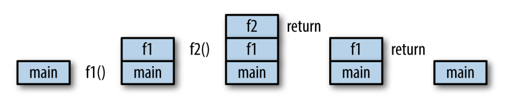

# Fungsi dan Pointer

---

# Agenda

- Fungsi
- Fungsi return value
- Fungsi multiple return
- Fungsi variadic
- Fungsi closure
- Fungsi sebagai parameter
- Pointer

---

# Function

-  Bagian modular dan independen dalam sebuah kode yang memetakan 0 atau lebih input parameter ke dalam 0 atau lebih output
-  Sebuah program biasanya tersusun dari beberapa function di dalamnya
-  Function yang selama ini kita gunakan adalah `main()` dan ini adalah fungsi yg wajib ada dalam sebuah program Go, karena ia adalah entry pointnya

---

# Fungsi

```go
package main

import "fmt"

func main() {
  fmt.Println("Hallo")
}
```

---

# Memanggil Fungsi Lain

```go
package main

import "fmt"

func main() {
  fmt.Println("Hallo")
  sayPagi()
}

func sayPagi() {
  fmt.Println("Selamat Pagi")
}
```

---

# Penjelasan Kode Program

- `func sayHello()` merupakan fungsi kedua yang berada pada file main.go
- fungsi ini dibuat karena memiliki peran untuk menampilkan pesan yang secara spesifik
- Kita dapat memanggil fungsi dari fungsi yang lain dengan menyebutkan nama fungsi tersebut


---

# Fungsi

- Bagian modular dan independen dalam sebuah kode yang memetakan 0 atau lebih input parameter ke dalam 0 atau lebih output
- Sebuah program biasanya tersusun dari beberapa fungsi di dalamnya
- fungsi yang selama ini kita gunakan adalah `main()` dan ini adalah fungsi yg wajib ada dalam sebuah program Go, karena ia adalah entry pointnya

---

# Membuat fungsi

- Misal kita punya fungsi seperti ini:

```go
func main() {
  diameter := 10
  keliling := 3.14 * diameter
  fmt.Println(keliling)
}
```

---

# Membuat fungsi

- Kita ingin agar prosedur menghitung keliling ini, bisa dilakukan di manapun, maka ada baiknya kita pisah ini menjadi fungsi sendiri

```go
func hitungKeliling(x float64) float64 {
  keliling := 3.14 * x
  return keliling
}

func main() {
  fmt.Println(hitungKeliling(4.0))
}
```

---

# Membuat Fungsi

- Fungsi dalam Go, memiliki format sebagai berikut

```go
func name(parameter) (result) {
  body
  return result
}
```

- dalam parameter dan result, kita perlu menetapkan nama dan tipe datanya dan keduanya akan menjadi variabel lokal di dalam fungsi tersebut
- _tahukah kamu apa perbedaan antara parameter dan argumen?_

---

# Membuat fungsi

- Perhatikan bahwa di fungsi yg kita buat tadi, kita mendefinisikan beberapa hal:
  - nama fungsi
  - parameter input dan tipe datanya
  - tipe data output
  - body fungsi
  - return value

---

# Membuat fungsi

- Khusus untuk tipe data, tipe data output yang dihasilkan oleh sebuah fungsi dan yang didefinisikan di awal, harus sama
- Di contoh tadi, kita menjanjikan bahwa output dari `hitungKeliling()` adalah `float64`, maka otomatis, nilai keluarannya (dalam hal ini, `keliling`) harus memiliki tipe data itu, dan tidak bisa yang lain, misal `int32`
- Perbedaan tipe data, akan dikomplain oleh compiler Go

---

# Fungsi dan Result

- Go menyediakan fleksibilitas dalam mendeklarasikan sebuah fungsi beserta resultnya
- Sebagai contoh, keempat pernyataan ini, valid

```go
func add(x int, y int) int   { return x + y }
func sub(x, y int) (z int)   { z = x - y; return }
func first(x int, _ int) int { return x }
func zero(int, int) int      { return 0 }
```

---

# Signature dalam sebuah fungsi

- Signature adalah tipe dari sebuah fungsi
- Signature terdiri dari urutan tipe data parameter dan urutan tipe data result
- 2 fungsi dikatakan memiliki tipe sama, jika signature keduanya sama

---

# Fungsi Memiliki Argument

- Sebuah fungsi yang di deklarasi memiliki argumen yang nantinya bisa di isi oleh program member lain
- Pemberian argumen ini berguna untuk program yang kita buat lebih dinamic karena argumen yang kita
  masukkan ke dalam fungsi tersebut dapat mempengaruhi proses fungsi yang kita buat.

---

```go
package main

import "fmt"

func main() {
  fmt.Println("Hallo")
  fmt.Println("Hallo", sayPagi("Foobar"))
}

func sayPagi(name string) string {
  return "Selamat Pagi " + name
}
```

---

# Parameter dan argumen

- _Parameter_ adalah variabel lokal yang berlaku di dalam sebuah fungsi dan digunakan di dalam body fungsi tersebut
- nilai awal dari variabel ini, ditentukan oleh _argumen_ yang diberikan oleh ia yang memanggil fungsi
- saat sebuah fungsi dipanggil, argumen diberikan dalam bentuk copy (salinan), sehingga perubahan di salinan ini tidak akan mempengaruhi pemanggil fungsi
- Kasus khusus, jika argumen diberikan dalam bentuk _reference_

---

# Call Stack

- saat sebuah fungsi dipanggil, maka ia akan menyusun urutan pemanggilan fungsi, yg dikenal dengan nama _call stack_
- Contoh:

```go
func main() {
    fmt.Println(f1())
}

func f1() int {
    return f2()
}

func f2() int {
    return 1
}
```

---

# Call Stack

- Urutan pemanggilan fungsi seperti tadi, kira-kira akan menghasilkan call stack sebagai berikut



---

# Argument

Argument yang kita passing ke dalam sebuah fungsi bisa jadi lebih dari satu.

```go
package main

import "fmt"

func main() {
  fmt.Println("Hallo")
  fmt.Println("Hallo", sayMalam("Foobar", "makan yuk"))
}

func sayMalam(name string, notes string) string {
  return "Selamat Malam " + name + " ajakan " + string
}
```

---

# Argument

Untuk fungsi yang memiliki lebih dari satu argumen kita bisa mempersingkat proses deklarasi argument tersebut seperti ini

```go
func sayMalam(name string, notes string)
```

menjadi

```go
func sayMalam(name, notes string)
```

---

# Contoh lengkap

```go
package main

import "fmt"

func main() {
  fmt.Println("Hallo")
  fmt.Println("Hallo", sayMalam("Foobar", "makan yuk"))
}

func sayMalam(name, notes string) string {
  return "Selamat Malam " + name + " ajakan " + string
}
```

---

# Contoh lain

Apabila terdapat argumen lain yang berbeda dengan argumen lainya bisa di deklarasikan sebagai berikut ini:

```go
package main

import (
  "fmt"
  "strconv"
)

func main() {
  fmt.Println("Hallo")
  fmt.Println("Hallo", sayMalam("Foobar", "makan yuk", 12))
}

func sayMalam(name, notes string, age int) string {
  return "Selamat Malam " + name + " ajakan " + notes + " umur " + strconv.Itoa(age)
}
```

---

# Fungsi Return Value

- Sebuah fungsi yang dibuat dapat di desain untuk melakukan pengembalian nilai atau tidak melakukan
  pengembalian sebuah nilai
- Untuk fungsi yang mengembalikan nilai maka perlu ditentukan tipe data nilai baliknya pada saat deklarasi

---

```go
package main

import "fmt"

func main() {
  fmt.Println("Hallo")
  fmt.Println("Hallo", sayPagi())
}

func sayPagi() string {
  return "Selamat Pagi"
}
```

---

Contoh pengembalian value berupa array

```go
package main

import "fmt"

func main() {
	fmt.Println("Hallo")
	fmt.Println("Hallo", otherArrayFunction())
}

func otherArrayFunction() []int {
	var m = make([]int, 2)
	m[0] = 1001
	m[1] = 1002

	return m
}

```

---

Kita juga bisa mengembalikan `map` dalam sebuah fungsi

```go
package main

import "fmt"

func main() {
  fmt.Println("Hallo")
  fmt.Println("Hallo", sayPagi())
}

func sayPagi() map[string]int {
  var m = make(map[string]int)
  m["1001"] = 1001
  m["1002"] = 1002

  return m
}
```

---

# Fungsi Multiple Return

Dalam bahasa Go kita bisa mengembalikan nilai lebih dari satu pada sebuah fungsinya.

Untuk pengembalian satu buah nilai kita melakukan hal ini.

```go
func FoobarFunction() int {}
```

Akan tetapi untuk fungsi mengembalikan nilai lebih dari satu maka ditulis menjadi seperti ini

```go
func FoobarFunction() (int, string) {}
func FoobarFunction() (int, string, string) {}
```

---

# Contoh

```go
package main
import "fmt"

func main() {
  status, ok := UserIsYoung(30)
  if !ok {
    fmt.Println(status)
  } else {
    fmt.Println(status)
  }
}

func UserIsYoung(age int) (string, bool) {
  if age < 20 {
    return "User berumur masih muda", true
  }

  return "User sudah tua", false
}

```

---

> # Tips
>
> Tidak ada batasan untuk mengembalikan nilai dari sebuah fungsi, namun direkomendasikan untuk membatasi jumlah multiple return menjadi hanya 2 (dua) buah saja

---

# Latihan

- Buatlah sebuah fungsi yang akan mencari sebuah string di dalam sebuah array of string
- Fungsi ini harus mengembalikan 2 hal: status pencarian ("found" atau "not found") dan string yang dicari

---

# Predefined variable di nilai yang dikembalikan

- Di golang sendiri, terkait dengan pengembalian nilai kita bisa melakukan predefined variable yang nantinya akan kita kembalikan.
- Dengan cara ini kita tidak perlu membuat variable dalam sebuah fungsi

---

```go
package main

import "fmt"

func main() {
	status, ok := UserIsYoung(30)
	if !ok {
		fmt.Println(status)
	} else {
		fmt.Println(status)
	}
}
```

---

```go
// UserIsYoung is
func UserIsYoung(age int) (notes string, status bool) {
	if age < 20 {
		notes = "User berumur masih muda"
		status = true
	} else {
		notes = "User sudah tua"
		status = false
	}
	return
}
```

---

# Pemberian Nama Fungsi

- Fungsi yang dibuat nantinya ada kemampuan untuk di akses oleh package yang lain
- Dalam Go visibility sebuah function tidak di deklarasikan secara explicit dengan menggunakan printah `private`
  dan `public`, akan tetapi mendeklarasikan sebuah fungsi itu private atau public dilakukan kaidah sebagai berikut:
  - Gunakan awalan **huruf besar** untuk fungsi yang nantinya di expose dan dapat digunakan oleh package lain
  - Gunakan awalan **huruf kecil** untuk fungsi yang nantinya hanya bisa digunakan dalam internal dari sebuah package

---

Contoh public method

```go
func FindAllUser() {}
```

Contoh private method

```go
func checkIfUserActive() {}
```

---

# Variadic Function

- Ini adalah cara untuk memanggil sebuah fungsi dengan nol atau lebih parameter

```go
func add(args ...int) int {
    total := 0
    for _, v := range args {
        total += v
    }
    return total
}

func main() {
    fmt.Println(add(1,2,3))
}
```

- Dalam contoh tadi, kita bisa memanggil fungsi `add()` dengan nol atau lebih `int`

---

# Latihan

- Buatlah sebuah variadic function yang akan digunakan untuk mencari angka terkecil dari sekumpulan angka

---

# Closure

- Jika dibutuhkan, kita bisa membuat fungsi di dalam sebuah fungsi lain

```go
func main() {
    add := func(x, y int) int {
        return x + y
    }
    fmt.Println(add(1,1))
}
```

---

# Closure

- Dengan cara seperti ini, fungsi tadi akan memiliki akses ke variabel lokal

```go
func main() {
    x := 0
    increment := func() int {
        x++
        return x
    }
    fmt.Println(increment())
    fmt.Println(increment())
}
```

---

# Closure

- fungsi yang dibuat seperti ini, beserta variabel non lokal yang ia acu, disebut sebagai `Closure`
- Dalam contoh tadi, `increment` dan `x` membentuk sebuah closure

---

# Closure

- 1 cara untuk menggunakan closure adalah dengan menulis sebuah fungsi yang mengembalikan fungsi lain
- Jika fungsi tadi dipanggil, ia bisa menghasilkan sekumpulan angka, yang nilainya beda di antara pemanggilan, berkat variabel lokal yang nilainya disimpan di antara pemanggilan fungsi

---

```go
func makeEvenNumber() func() uint {
    i := uint(0)
    return func() (ret uint) {
        ret = i
        i += 2
        return
    }
}
func main() {
    nextEven := makeEvenNumber()
    fmt.Println(nextEven()) // 0
    fmt.Println(nextEven()) // 2
    fmt.Println(nextEven()) // 4
}
```

---

# Rekursi

- Sebuah fungsi juga bisa memanggil dirinya sendiri
- Contohnya, untuk menghitung angka factorial

```go
func factorial(x uint) uint {
    if x == 0 {
        return 1
    }
    return x * factorial(x-1)
}
```

---

# Latihan

- Buatlah sebuah program yang akan menghasilkan deret Fibonacci (1, 2, 3, 5, 8, 13, etc.) yang menggunakan teknik rekursi

---

# Fungsi sebagai parameter

- Dalam Go, function adalah first-class value, sehingga ia bisa diperlakukan sebagaimana sebuah variabel
- Artinya, ia bisa diassign ke sebuah variabel, ataupun digunakan sebagai parameter dalam function lain, bahkan digunakan sebagai nilai kembali (_return value_) sebuah fungsi lain

---

# Fungsi sebagai parameter

```go
func square(n int) int     { return n * n }
func negative(n int) int   { return -n }
func product(m, n int) int { return m * n }

f := square
fmt.Println(f(3)) // "9"

f = negative
fmt.Println(f(3))     // "-3"
fmt.Printf("%T\n", f) // "func(int) int"
```

---

# Fungsi sebagai parameter

- Karena bisa digunakan sebagai parameter, maka dalam pengaplikasiannya, menjadi lebih mudah bagi kita untuk menggunakan sebuah fungsi di atas sekumpulan data, dengan perilaku tertentu, mirip dengan JavaScript
- Contohnya, penggunaan `strings.Map` yang mengaplikasikan sebuah fungsi untuk setiap karakter di dalam sebuah string dan di akhir, menyatukan kembali semua karakter-karakter ini

---

```go
package main

import "fmt"

func calkulasi(m func(int) int, n int) int {
	return m(n) + n
}

func mm(data int) int {
	return data * 2
}

func yy(data int) int {
	return data * 5
}

func main() {
	fmt.Println(calkulasi(mm, 1)) // mm di passing ke sini sebagai funcion luas
	fmt.Println(calkulasi(yy, 1)) // mm di passing ke sini sebagai funcion
}
```

---

# Fungsi dan nil

- Nilai nol dari sebuah tipe data function adalah `nil`
- Memanggil `nil` akan mengakibatkan `panic`
- _Mengapakah di bawah ini terjadi panic?_

```go
var f func(int) int
f(3) // panic
```

---

# Pointers

- Ketika kita memanggil sebuah fungsi yang menggunakan argumen, argumen tersebut dikopi ke fungsi yang memanggilnya
- Di contoh ini, nilai x di `zero()` dan `main()` sebenarnya mengacu ke alamat yang berbeda di memory

```
func zero(x int) {
    x = 0
}

func main() {
    x := 5
    zero(x)
    fmt.Println(x) // x is still 5
}
```

---

# Pointers

- Jika kita ingin menunjuk alamat di memory, tempat sebuah nilai disimpan dan bukan nilainya itu sendiri, maka kita bisa menggunakan pointer
- Pointer ditandai dengan tanda asterisk (`*`)

```
func zero(xPtr *int) {
    *xPtr = 0
}
func main() {
    x := 5
    zero(&x)
    fmt.Println(x) // x is 0
}
```

---

# Pointers

- `*xPtr = 0` berarti kita sedang mengatakan "simpan `int 0` di alamat memory yang ditunjuk oleh xPtr"
- Menulis `xPtr = 0` akan menghasilkan error saat compile, karena `xPtr` bukan `int`, ia adalah `*int` yang hanya bisa menerima `*int` yang lain
- Kita menggunakan `&` untuk mencari alamat sebuah variabel
- `&x` mengembalikan sebuah `*int`atau pointer ke `int` karena `x` adalah sebuah `int`
- Inilah megnapa kita bisa mengubah variabel awal, `&x` di `main` dan `xPtr` di `zero` mengacu ke alamat yang sama

---

# new

- Cara lain untuk mendapatkan pointer adalah dengan `new`

```
func one(xPtr *int) {
    *xPtr = 1
}

func main() {
    xPtr := new(int)
    one(xPtr)
    fmt.Println(*xPtr) // x is 1
}
```

---

# new

- `new` akan mengambil sebuah tipe sebagai argumen, mengalokasikan cukup ruang di memory untuk tipe tersebut dan mengembalikan pointer ke alamat tersebut
- Go memiliki garbage collector, sehingga apapun yg dibuat dengan `new` tidak perlu kita bersihkan
- Pointer akan sangat berguna saat kita bekerja dengan `struct` di pertemuan berikutnya

---

# Latihan

- Buatlah sebuah program yang akan menukar 2 buah integer
- (x := 1; y := 2; swap(&x, &y) harus menghasilkan x=2 and y=1)

---

# Latihan

- Buat sebuah program yang akan membaca data dari sebuah teks panjang
- Program ini kemudian akan menampilkan:
  - Kata yang paling sering muncul
  - Jumlah berapa kali kata tersebut muncul
  - Jumlah total kata
  - Berapa lama waktu yang dibutuhkan untuk membaca teks tersebut, asumsikan dibutuhkan waktu 1 menit untuk membaca 200 kata
