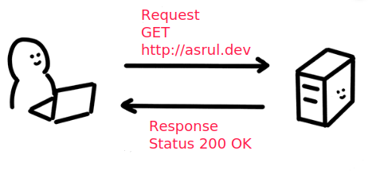

# Http Service

---

Sebelum kita mulai pernahkah kalian:

- Apa itu topologi client and server?
- Bagaimana cara bekerjanya?
- Berikan contohnya!

---



---

# Http Service

- Merupakan layanan yang diberikan oleh sebuah aplikasi web yang memungkinkan untuk digunakan oleh user
- User ini bisa berarti end user atau third party yang bisa melakukan integrasi layanan yang ia miliki,
  semisal facebook memiliki http service auth, kita bisa menggunakan layanan tersebut melalui facebook 
  atau kita melakukan develop aplikasi lagi on top off layanan facebook
- Menggunakan protocol Http sebagai jalur komunikasi antara penyedia layanan dengan user yang membutuhkan layanan tersebut

---

# Karakteristik

- Memiki web server sebagai penyedia layanan http protocol
- Web server tersebut sebagai middleware layanan yang menghubungkan dunia luar ke dalam aplikasi yang kita sediakan

---

# Http Service

Teknik yang digunakan untuk membuat http service biasanya menggunakan metologi salah satu dari dibawah ini

- Restfull API
- GraphQL

---

# Restfull API

- REST (Representational State Transfer) adalah salah satu pilihan API yang paling terkenal
- REST mengekspos sebuah resource dalam bentuk URL HTTP tertentu
- Ia kemudian akan menggunakan metode HTTP standar (Create, Read, Update, Delete) untuk mewakili transaksi terhadap resource ini
- Http standar yang digunakan adalah penggunaan http verb yang terdiri dari `GET`, `POST`, `PUT`, `PATCH` dan `DELETE`

---

# Contoh

Terdapat endpoint `api/users` dalam satu endpoint ini terdapat berbagai fungsi sesuai dengan http verbnya

- GET `/api/users` akan mendapatkan seluruh data user list
- GET `/api/users/1` akan mendapatkan single user dengan id `1`
- POST `/api/users` untuk melakukan create user
- PUT `/api/users/1` atau PATCH `/api/users/1`  untuk mengupdate user dengan id `1`
- DELETE `/api/users/1` untuk menghapus user dengan id `id`

---

# Contoh

Untuk memahami lebih lanjut terkait rest api mari kita coba melakukan prakti dibawah ini

- Donwload terlebih dahulu postman https://www.postman.com/
- Kunjungi http://dummy.restapiexample.com/, disana sudah tersedia endpoint yang bisa digunakan untuk operasi restffull
- Gunakan postman untuk berinteraksi terhadap http service di atas

---

# Pertanyan

Mana yang dibawah ini yang merupakan http service yang menggunakan restfull

1. GET `/api/articles?page=2&limit=10`
2. POST `/api/articles/10`
3. POST `/api/articles/update-article/10`
4. POST `/api/articles/create-article`
5. PUT `/api/articles/10`

Bisa disebutkan kenapa?

---

# Authentication

Pada umumnya untuk proses autentikasi tidak menggunakan sesion akan tetapi menggunakan `Authorization key` yang pada umumnya di passing pada:
- header pada saat melakukan request pada endpoint tertentu
- body parameter request

---

# Mengimplementasikan Http Service

- Kita akan menggunakan library web server framewrok dengan menggunakan `Echo Framework`
- Lakukan `go get -u github.com/labstack/echo/` untuk menambahkan dependencies project kita

---

# Imlementasi Echo Framework

Buah project baru

```sh
$ mkdir http-service
$ go mod init github.com/purwandi/http-service
$ get -u github.com/labstack/echo
$ touch main.go
```

---

Buat instance echo framework, pada file main.go yang tadi kita buat isikan code sebagai berikut

```go
import (
  "net/http"

  "github.com/labstack/echo"
)

func main() {
  e := echo.New()
}
```

---

Buat handler untuk menerima request dari user

```go
func main() {
  e := echo.New()
  e.GET("/", func(c echo.Context) error {
    return c.String(http.StatusOK, "Hello, World!")
  })
}
```

---

# Start echo framework

```go
func main() {
  e := echo.New()
  e.GET("/", func(c echo.Context) error {
    return c.String(http.StatusOK, "Hello, World!")
  })
  e.Logger.Fatal(e.Start(":1323"))
}
```

```sh
$ go run main.go
```

---

# Penjelasan

`e.[METHOD]([URI], [HANDLER])`

- `e.` merupakan instance dari echo framework konteks
- `GET` merupakan implementasi dari HTTP verb, sehingga dalam hal ini nantinya akan memuat beberapa variasi seperti `GET`, `POST`, `PUT`, `PATCH` dan `DELETE`
- `"/"` merupakan endpoint yang kita define, apabila nanti terdapat request sesuai yang kita definisikan maka request tersebut akan kita handle
- `func (e echo.Context) {}` merupakan handler yang kita ingin ekesuksi nantinya

---

# Request

- Gunakan `c.QueryParam('field)` untuk mengambil value  query string dari sebuah request
- Gunakan `c.FromValue('field')` untuk mengambil post calue dari sebuah request

---

# QueryParam

Semisal kita mengakses sebuah web service `http://localhost:8080/user?user=foobar` maka untuk 
mendapatkan nilai dari query params user adalah dengan menggunakan queryparams

```go

func main() {
  e := echo.New()
  e.GET("/", func (c echo.Context) error {
    user := c.QueryParam("user")
    return c.String(http.StatusOK, user)
  })
  e.Logger.Fatal(e.Start(":8080"))
}
```

atau bisa menggunakan `curl http://localhost:8080/\?user\=foobar`

---

# FormValue

```go
func main() {
  e := echo.New()
  e.POST("/", func (c echo.Context) error {
    user := c.FormValue("user")
    return c.String(http.StatusOK, user)
  })
  e.Logger.Fatal(e.Start(":8080"))
}


```

menggunakan postman untuk mengirimkan postdata atau `curl -d "user=foobar&form=dsds" http://localhost:8080/`

---

# Response

Ada beberapa response yang bisa dikirimkan oleh echo framework, namun pada umumnya yang digunakan

- `c.String(http.StatusOK, "Hello, World!")` apabila ingin mengirimkan berupa plain text response
- `c.HTML(http.StatusOK, "<strong>Hello, World!</strong>")` berupa html
- `c.JSON(http.StatusOK, [instance struct])` berupa json

---

# Implementasi

Mari buat file main.go yang didalamnya terdapat routing

- GET `/articles` untuk mendapatkan list article
- GET `/articles/:id` untuk mendapatkan single article
- POST `/articles` untuk melakukan create article baru
- PUT `/articles/:id` untuk mengupdate article berdasarkan uuid tersebut
- DELETE `/articles/:id` untuk menghapus article

Biarkan body di masing-masing handler kosong

---

# InMemory Database

- Penyimpanan sementara data dalam memory
- Hanya ada ketika sebuah program itu dijalankan dan akan hilang apabila
  program tersebut di stop
- Hal ini bisa dilakukan dengan go, karena yang bersifat log running process

---

Mari kita buat package model, yang isinya article.go dan article_store.go

```sh
- /http-service
  - /model
    - article.go
    - article_store.go
  - go.mod
  - main.go
```
---

Isi dari file article.go kurang lebih seperti ini

```go
type Article struct {
  ID int
  Title string
  Body string
}

func CreateArticle(title, body string) (*Article, error) {
  return &Article{}, nil
}

func (a *Article) ChangeTitle(title string) error {
  // 
}
```

---

sedangkan untuk data store kita akan implement 

```go
type ArticleStoreInMemory struct {
  ArticleMap []Article
}

func NewArticleStoreInMemory() *ArticleStoreInMemory {
  return &ArticleStoreInMemory{}
}
```

--- 

# Keterangan

- `ArticleStoreInMemory` ini merupakan struct yang nantinya memiliki isi ArticleMap yang merupakan slice of Article
- `NewArticleStoreInMemory` ini merupakan cara kita untuk membuat instance dari `ArticleStoreInMemory`


---

Mari kita coba implementasikan di main.go kita

```go
func main() {
	// 1. init data
	store := model.NewArticleStoreInmemory()

  e := echo.New()

  // 2 endpoint rest
	e.GET("/articles", func(c echo.Context) error {
    
    // 3 mengambil data dari in memory store 
    articles := store.ArticleMap
    
    // 4 return data
		return c.JSON(http.StatusOK, articles)
	})

	e.Logger.Fatal(e.Start(":8080"))
}
```

---

# Keterangan

1. Merupakan cara kita untuk membuat instance dari in memory database yang nantinya menampung data article
2. Membuat routing article
3. Membuat variable sementara sebagai data article
4. Melakukan print articles data

---

Jalankan

```sh
$ go run main.go
```

Buka tab baru lalu lakukan perintah

```sh
$ curl http://localhost:8080/articles
```

---

# Initiasi Data

Kita juga bisa melakukan initasi data awal dengan cara merubah pengembalian instance dari `NewArticleStoreInmemory`

```go
func NewArticleStoreInmemory() *ArticleStoreInmemory {
	return &ArticleStoreInmemory{
		ArticleMap: []Article{
			Article{ID: 1, Title: "Membuat website", Body: "Hallo ini bydi"},
		},
	}
}
```

sehingga dengan cara seperti ini, ketika melakukan start server maka akan ada 
default sesuai yang terdapat pada code di atas

---

Coba jalankan ulang dan akses kembali

---

# Ehance Untuk menyimpan

```go
func (store *ArticleStoreInmemory) Save(article *Article) error {
  // 1. calculate current length
	lastID := len(store.ArticleMap)

	// set article id
	article.ID = lastID + 1

	// push to article map slices
	store.ArticleMap = append(store.ArticleMap, *article)

	return nil
}
```

---

# Keterangan

1. `lastID := len(store.ArticleMap)` melakukan proses kalkulasi dalam store sudah ada berapa article
2. `article.ID = lastID + 1` melakukan set article yang di pasing dalam argument id terakhir yang saat + 1
3. `store.ArticleMap = append(store.ArticleMap, *article)` melakukan append data ke store

---

Mari kita cek lagi di main.go kita

```go
func main () {
  // ... func e.GET

  e.POST("/articles", func(c echo.Context) error {
    // 1. mengambil data dari form value
		title := c.FormValue("title")
		body := c.FormValue("body")

		// 2. create article instance
		article := model.CreateArticle(title, body)

    // 3. save ke store
		store.Save(article)

		return c.JSON(http.StatusOK, article)
  })
  
  // ...
}
``` 

---

# Jalankan ulang

- Close aplikasi yang berjalan
- Lalu jalankan ulang
- Lakukan perintah `curl -d "title=Judul Article&body=dsds" http://localhost:8080/articles` untuk mengakses feature baru tersebut
- Akses ulang listnya `curl http://localhost:8080/articles`

---

# Latihan

Lanjutkan restfull api diatas sampai 

- ~~GET `/articles` untuk mendapatkan list article~~
- GET `/articles/:id` untuk mendapatkan single article
- ~~POST `/articles` untuk melakukan create article baru~~
- PUT `/articles/:id` untuk mengupdate article berdasarkan id tersebut
- DELETE `/articles/:id` untuk menghapus article