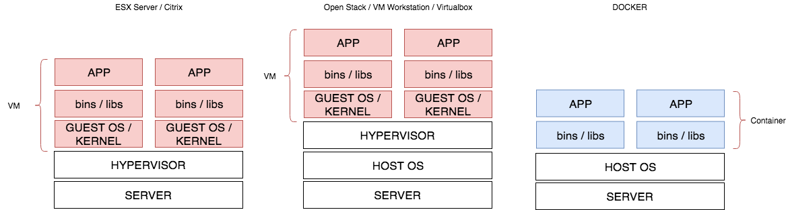

# Docker

---

# VM - Container



---


---

# Installer Docker

- Linux
  https://docs.docker.com/install/
- Mac 
  https://download.docker.com/mac/stable/Docker.dmg
- Windows
  https://download.docker.com/win/stable/Docker%20for%20Windows%20Installer.exe

---

# Check Docker

Buka terminal dan lakukan perintah dibawah ini untuk melakukan pengecekan apakah docker sudah terinstall dengan baik.

```sh
$ docker version
```

---

# Docker Registry

Merupakan sebuah platform respository yang ditujukan untuk menyimpan snapshoot image.

- https://hub.docker.com
- https://registry.gitlab.com

---


# Docker Flow Fundamental


 


---

# Find Image


--- 


---

# Pull Image

```
$ docker pull mysql:5.7
```

Untuk mengambil image template dari https://hub.docker.com/_/mysql

- `5.7` adalah spesifik versi yang ingin kita pakai
- apabila tidak di define `docker pull mysql` maka akan mengambil yang latest dari build imagenya, yang dalam hal ini adalah `8.0.*`

---

# Create Container

```
$ docker create <nama-image>
$ docker create mysql:5.7
```

Untuk membuat sebuah container

```
$ docker create --name database mysql:5.7
```
---

# Melihat List Container

```
$ docker ps -a
```

Untuk melihat container baik dalam kondisi mati maupun hidup


---

# Menjalankan container

```
$ docker start <nama_container>
$ docker start database
```

---

# Menstop container

```
$ docker stop <nama_container>
$ docker stop database
```

---

# Menghapus container

```
$ docker rm <nama_container>
$ docker rm database
```

---

# Memanfaatkan Layanan Container

- Dalam hal ini kita menggunakan MySQL
- Mari buka https://hub.docker.com/_/mysql dan yuk kita baca dokumentasinya
- Setup apa aja sih yang perlu kita lakukan untuk membuat database?

---

- Username
- Password
- Nama Database

> Mari kita cari di dokumentasinya mengenai ke tiga hal tersebut.

---

# Implement Variable

```
$ docker create \	
     -e MYSQL_ROOT_PASSWORD=password \
     -e MYSQL_DATABASE=database \
     --name database mysql:5.7
$ docker start database
$ docker stop database
$ docker rm database
```

- `-e` adalah environment variable yang bisa kita passing ke dalam argument ketika membuat container
- Dalam dokumentasi `mysql` image membutuhkan argument ini untuk memberi tahu, ketika ada environment yang set maka akan ada trigger selanjutnya dari proses pembuatan containernya

---

# Mengexpose Layanan

```sh
$ docker create \	
     -e MYSQL_ROOT_PASSWORD=password \
     -e MYSQL_DATABASE=database \
     -p 3307:3306 \
     --name database_app mysql:5.7
$ docker start database_app
$ docker stop database_app
$ docker rm database_app
```

- `3307` merupakan port yang bisa di akses dari host ketika ingin mengakses container. Dengan begini kita bisa mengakses `database` container dengan menggunakan port dari docker hostnya
- `3306` merupakan port yang dibuka oleh container yang nantinya bisa di expose oleh docker hostnya 

---

# PHPMyAdmin

```sh
$ docker create \
  --link database_app:db \
  -p 8081:80 \
  --name myadmin_app phpmyadmin/phpmyadmin
$ docker start myadmin_app
$ docker stop myadmin_app
$ docker rm myadmin_app
```

- PHPAdmin adalah GUI tools yang kita gunakan untuk melakukan managerial mysql
- Silahkan akses ke http://localhost:8081
- Login dengan menggunakan username = root dan password = password

---

# Mari Buat Article Table

- id autoincrement
- title varchar(255)
- body text

---

# Database

---

# Next Up

- Kemarin kita sudah berhasil menyusun sebuah aplikasi crud dengan menggunakan in memory database
- Karena sudah selesai dan tidak perlu melakukan perubah kode kembali tahapan selanjutnya adalah mengimplementasikan `storage` yang tadinya di tampung dalam memorty sementara ke database yang nyata.

---

# To Be Clear

- Entry point `main.go` kita hanyalah berisi untuk melakukan mapping lalu lintas request dan response
- Sebisa mungkin proses perubahan resource dilakukan diluar file `main.go`
  sehingga pada file tersebut tidak akan melakukan penumpukkan data

---

# Mengingat Kembali

```sh
- /http-service
  - /model
    - article.go
    - article_store.go
  - go.mod
  - main.go
```

---

- Saat ini kita hanya memiliki in memory database
- Aplikasi kita sudah grow dan siap untuk naik ke production
- Penyimpan in memory database tersebut tidak akan kita gunakan
  dalam production stage

---

# Mari Kita Rubah Strukture Code

```sh
- /http-service
  - /model
    - article.go
    - article_store.go
    - article_store_inmemory.go
    - article_store_mysql.go
  - go.mod
  - main.go
```

---

# Keterangan

- `article_store.go` nantinya hanya akan berisi kontrak
- `article_store_inmemory.go` isinya akan implementasi dari in memory database
- `article_store_mysql.go` isinya akan implementasi dari database mysql

---

# Step 1

- Pindahkan seluruh isi dari `article_store.go` ke `article_store_inmemory.go`
- Pada `article_store.go` tulis code sebagai berikut:

```go
// article_store.go
package model

type ArticleStore interface {
  All() []Article
  Save(*Article) error
  Find(int) *Article
  Update(*Article) error
  Delete(article *Article) error
}
```

---

# Step 2

- Pada file article_store_inmemory.go
- Pada NewArticleStoreInmemory yang sebelumnya mengembalikan sebuah struct ArticleStoreInmemory kita rubah menjadi return interface dalam hal ini `ArticleStore`

```go
// func NewArticleStoreInmemory() ArticleStoreInmemory {
func NewArticleStoreInmemory() ArticleStore {
  return &ArticleStoreInmemory{
    ArticleMap: []Article{
      Article{ID: 1, Title: "Membuat website", Body: "Hallo ini bydi"},
      Article{ID: 2, Title: "Membuat website 2", Body: "Hallo ini bydi 2"},
    },
  }
}
```

---

# Step 3

Karena kita menambahkan method `All` pada interface maka kita perlu menambahkan method baru yang merupakan implementasi dari interface tersebut

```go
func (store *ArticleStoreInmemory) All() []Article {
  return store.ArticleMap
}
```

---

# Step 4

Pada main.go kita coba modifikasi fungsi main

```go
func app(e *echo.Echo, store model.ArticleStore) {
  // Pindahkan seluruh routing ke sini
}

func main() {
  var store model.ArticleStore
  driver := "inmemory"

  // init data store
  if driver == "inmemory" {
    store := model.NewArticleStoreInmemory()
  } else {
    store := model.NewArticleStoreMySQL()
  }

  // Create new instance echo framework
  e := echo.New()
  app(e, store)
  e.Logger.Fatal(e.Start(":8080"))
}
```

---

# Keterangan

1. Kita membuat fungsi app() yang memiliki dua buah argument
2. Argumen pertama merupakan instance dari echo framework
3. Argumen kedua adalah data store yang nantinya kita gunakan untuk 
   berinteraksi dengan data store kita baik itu inmemory atau mysql
4. Data store yang kita passing merupakan interface 

---

# Step 5

Coba jalankan ulang aplikasinya apakah masih bisa berjalan?

---

# Enhancment menggunakan MySQL

---

# Koneksi Database

Golang memiliki package official yang dapat digunakan untuk melakukan koneksi ke database

> https://golang.org/pkg/database/sql/

---

# Driver

Namun dalam penggunaanya package ini hanya menyediakan interface yang nantinya di implementasikan oleh masing-masing driver, dalam hal ini:

- SQLite : https://github.com/mattn/go-sqlite3/
- PostgreSQL : https://github.com/lib/pq
- MySQL : https://github.com/go-sql-driver/mysql/

> Untuk melihat list driver yang di support oleh pakckage sql ini 
> https://github.com/golang/go/wiki/SQLDrivers

---


# Step 0

- Download dep

```
$ go get -u database/sql
$ go get -u github.com/go-sql-driver/mysql
```
- Pada main.go kita, kita akan import driver mysql

```go
package main

import (
  // ...

  _ "github.com/go-sql-driver/mysql"
  "github.com/labstack/echo"
  // ...
)

```

---


# Step 1

Buat fungsi untuk article store mysql

```go
package model

import "database/sql"

type ArticleStoreMySQL struct {
  DB *sql.DB
}

func NewArticleStoreMySQL() ArticleStore {
  dsn := "root:password@localhost:3307/database?parseTime=true&clientFoundRows=true"
  db, err := sql.Open("mysql", dsn)
  if err != nil {
    panic(err)
  }

  return &ArticleStoreMySQL{DB: db}
}
```

---

# Step 2

Implementasikan seluruh interface `ArticleStore`

```go
func (store *ArticleStoreMySQL) All() []Article {
  return []Article{}
}
func (store *ArticleStoreMySQL) Save(*Article) error {
  return nil
}
func (store *ArticleStoreMySQL) Find(int) *Article {
  return &Article{}
}
func (store *ArticleStoreMySQL) Update(*Article) error {
  return nil
}
func (store *ArticleStoreMySQL) Delete(article *Article) error {
  return nil
}
```

---

# Step 3 - Fungsi All

```go
func (store *ArticleStoreMySQL) All() []Article {
  articles := []Article{}
  rows, err := store.DB.Query("SELECT * FROM articles")
  if err != nil {
    return articles
  }

  article := Article{}
  for rows.Next() {
    rows.Scan(&article.ID, &article.Title, &article.Body)
    articles = append(articles, article)
  }

  return articles
}
```

---

# Step 4 - Fungsi Save

```go
func (store *ArticleStoreMySQL) Save(article *Article) error {
  result, err := store.DB.Exec(`
    INSERT INTO articles(title, body) VALUES(?,?)`, article.Title, article.Body,
  )
  if err != nil {
    return err
  }
  _, err = result.RowsAffected()
  if err != nil {
    return err
  }
  // update article.ID
  lastID, err := result.LastInsertId()
  if err != nil {
    return err
  }

  article.ID = int(lastID)
  return nil
}
```

---

# Step 5 - Fungsi Find 

```go
func (store *ArticleStoreMySQL) Find(id int) *Article {
  article := Article{}

  err := store.DB.
    QueryRow(`SELECT * FROM articles WHERE id=?`, id).
    Scan(
      &article.ID,
      &article.Title,
      &article.Body,
    )

  if err != nil {
    log.Fatal(err)
    return nil
  }

  return &article
}
```

---

# Step 6 - Fungsi Update

```go
func (store *ArticleStoreMySQL) Update(article *Article) error {
  result, err := store.DB.Exec(`
    UPDATE articles SET title = ?, body = ? WHERE id = ?`,
    article.Title,
    article.Body,
    article.ID,
  )
  if err != nil {
    return err
  }

  _, err = result.RowsAffected()
  if err != nil {
    return err
  }

  return nil
}
```

---

# Step 7 - Fungsi Delete

```go
func (store *ArticleStoreMySQL) Delete(article *Article) error {
  result, err := store.DB.Exec(`
    DELETE FROM articles WHERE id = ?`,
    article.ID,
  )
  if err != nil {
    return err
  }

  _, err = result.RowsAffected()
  if err != nil {
    return err
  }
  return nil
}
```

---

# Build

Kita melakukan build aplikasi yang sudah kita buat

```
$ go build main.go
```

Dengan langkah ini nanti dalam current directory akan ada binary 
yang bisa di execute secara langsung

```
$ ./main
```